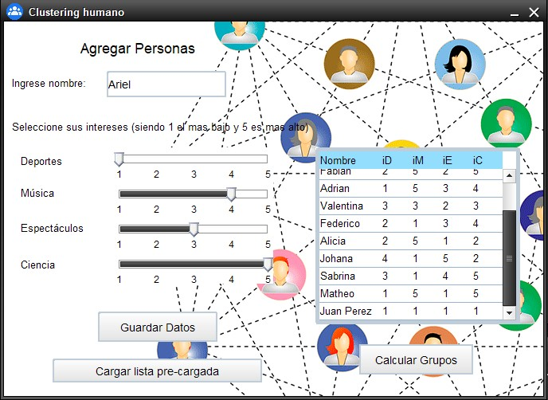

= Clustering humano

La implementación de este proyecto fue realizada con grafos y utilizando el algoritmo de Prim.

El objetivo de este proyecto es implementar una aplicación para identificar automáticamente grupos de personas basada en sus gustos particulares.
Tenemos una lista de personas, y para cada persona i tenemos su nombre y los siguientes datos:

*iD: Interés por los deportes.
*iM: Interés por la música.
*iE: Interés por las noticias del espectáculo.
*iC = Interés por la ciencia.

Cada uno de estos datos se expresa como un entero entre 1 y 5, siendo 1 el menos interés y 5 el máximo interés en el tema. 
Buscamos dividir a esta población en dos grupos con intereses similares. Para esto utilizaremos el siguiente algoritmo:
Construir un grafo completo G con un vértice por cada persona, una arista entre cada par de personas, y de modo tal que cada arista tiene peso igual al índice de similaridad entre las dos personas.
Construir un árbol generador mínimo T de G.
Eliminar la arista de mayor peso del árbol T.
Las dos componentes conexas del grafo resultante son los dos grupos que estamos buscando.

El índice de similaridad entre dos personas i y j se define como: similaridad(i,j) = |id - jd| + |im - jm| + |ie je| + |ic - jc|

.Imagen del proyecto

